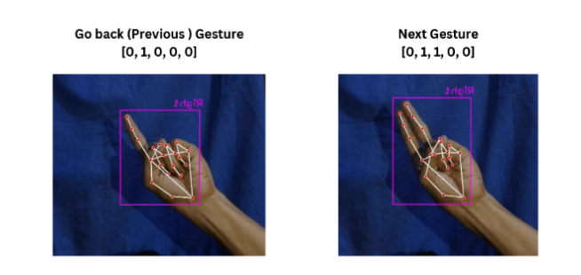
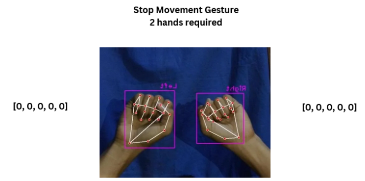
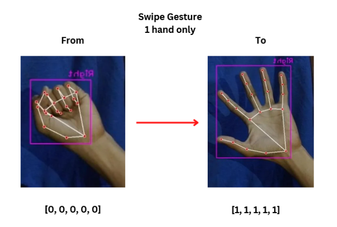

# Hand Gesture Recognition for Interactive Solar System Model


Welcome to the hand gesture recognition code repository for our Thesis Project, titled "Interactive Real-time Solar System Model Using Hand Gesture Recognition and Pseudoholography." This project showcases the integration of hand gesture recognition to control and interact with a real-time solar system model. With this code, you can explore the solar system model using your hand gestures.

## Installation

To get started, you need to install the required libraries. You can do this using `pip`:

```bash
pip install -r requirements.txt
```

## Running the Program

Once you have installed the necessary libraries, you can run the hand gesture recognition program by executing the following command:

```bash
python Hand_Gesture_Recognition.py
```

## Project Overview

Our project leverages the power of the OpenCV library to recognize and track hand gestures. By identifying key landmarks on the hand, we can track the hand's movement and analyze its configuration for gesture recognition. The following sections provide an overview of the key components and features of our hand gesture recognition system.
Hand Landmarks Tracking

## Hand Landmarks


We utilize OpenCV to identify and track hand landmarks, capturing coordinates on the x, y, and z axes. Of the over 20 hand landmarks, we focus on the landmark number 9, which corresponds to the MIDDLE_FINGER_MCP (Middle Finger Metacarpophalangeal joint) since it's located closest to the palm.
Hand Gesture Classification

To determine whether the hand is open or closed, we use an array of numbers, with each number representing a finger. When a finger is closed, its corresponding number is 0, and when it's open, it's 1. A closed hand is represented by an array of numbers [0,0,0,0,0], and an open hand is represented by [1,1,1,1,1].
Gesture Controls


By combining hand movement tracking and hand state recognition, we've implemented six different hand gesture controls for users to interact with the Solar System model. These gestures add a layer of interactivity and immersion, making it easy for users to navigate and explore the Solar System Model.
Gesture Demonstrations

## Go Back and Go Next Gesture

#### This gesture allows users to navigate through the Solar System Model, moving either backward or forward.

## Drag Gesture

#### The drag gesture enables users to control the exploration of their selected asset within the Solar System Model.

## Stop Gesture

#### This gesture brings a chosen asset in the Solar System Model to a halt, stopping it from spinning.


## Scale Gesture

#### With the scale gesture, users can dynamically resize their selected asset within the Solar System Model.


## Swipe Gesture

#### The swipe gesture lets users shift their chosen asset in any direction within the Solar System Model as long as their hand is detected.

## Conclusion

Our hand gesture recognition system enhances the interactivity and immersion of the Solar System Model, making it an engaging and user-friendly experience. Feel free to explore and adapt this code to your own projects, and enjoy the wonders of interactive solar system exploration.